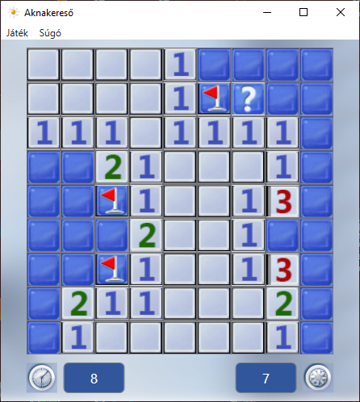
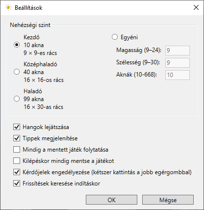
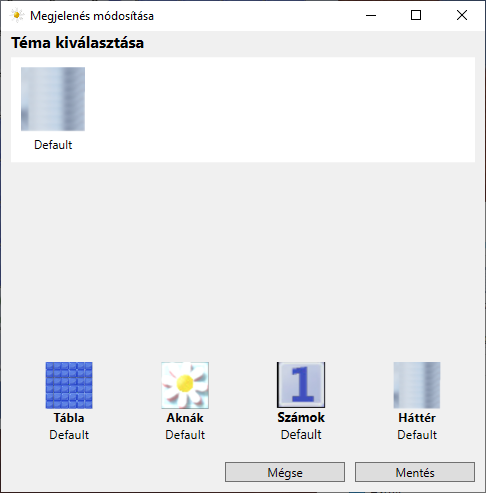
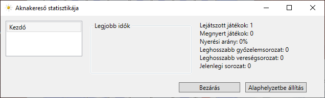

# Minesweeper-WPF

## Bevezető

Ez a játék az [Aknakereső-konzol](https://github.com/vgeri108/minesweeper) fejlett változata lesz. A nagy különbség az, hogy a konzolappban nem lehetett egérrel játszani, de ebben az alkalmazásban már lehet.

## Képernyőképek

