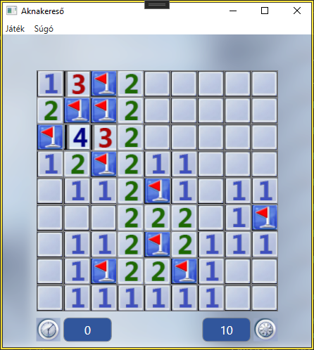

# Minesweeper-WPF

## Bevezető

Ez a játék az [Aknakereső-konzol](https://github.com/vgeri108/minesweeper) fejlett változata lesz. A nagy különbség az, hogy a konzolappban nem lehetett egérrel játszani, de ebben az alkalmazásban már lehet.

## Fejlesztés alatt áll

A játék még fejlesztés alatt áll, de már játszahtó.

Hátralévő feladatok:
- Dupla klikkelés a számokrá kiássa a szomszédos mezőket
- Kérdőjelek letiltása a beállításokban
- Több alkalmazás beállítás
- Egyéb beállítások és [hibajavítások](https://github.com/vgeri108/Minesweeper-WPF/issues)

## Képernyőképek

